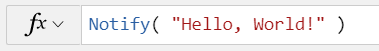

# Microsoft Power Fx

Power Fx is a low-code general purpose programming language based on spreadsheet-like formulas.  It is a strongly typed, declarative, and functional language, with imperative logic and state management available as needed.  

Power Fx started with Power Apps canvas apps and that is where [you can experience it now](https://powerapps.microsoft.com/en-us/).  We are in the process of extracting the language from that product so that we can use it in more Microsoft Power Platform products and make it available here for you to use.  That's going to take some time and we will report on our progress here and on the [Power Apps blog](https://powerapps.microsoft.com/en-us/blog/).  

A start on the language documentation is [available in the docs folder](docs/overview.md).  As with the implementation, it is being extracted from the Power Apps documentation and generalized and that too is going to take some time.

## Contributing

This project welcomes contributions and suggestions.  Most contributions require you to agree to a
Contributor License Agreement (CLA) declaring that you have the right to, and actually do, grant us
the rights to use your contribution. For details, visit https://cla.opensource.microsoft.com.

When you submit a pull request, a CLA bot will automatically determine whether you need to provide
a CLA and decorate the PR appropriately (e.g., status check, comment). Simply follow the instructions
provided by the bot. You will only need to do this once across all repos using our CLA.

This project has adopted the [Microsoft Open Source Code of Conduct](https://opensource.microsoft.com/codeofconduct/).
For more information see the [Code of Conduct FAQ](https://opensource.microsoft.com/codeofconduct/faq/) or
contact [opencode@microsoft.com](mailto:opencode@microsoft.com) with any additional questions or comments.

## Trademarks

This project may contain trademarks or logos for projects, products, or services. Authorized use of Microsoft 
trademarks or logos is subject to and must follow 
[Microsoft's Trademark & Brand Guidelines](https://www.microsoft.com/en-us/legal/intellectualproperty/trademarks/usage/general).
Use of Microsoft trademarks or logos in modified versions of this project must not cause confusion or imply Microsoft sponsorship.
Any use of third-party trademarks or logos are subject to those third-party's policies.
