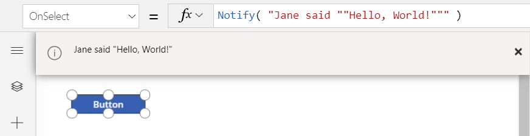
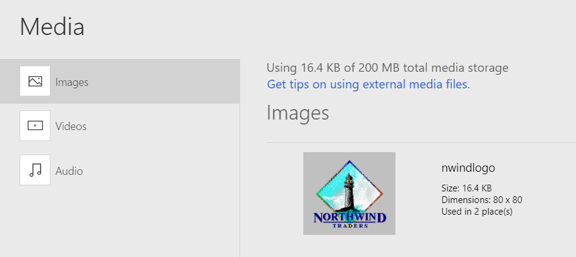
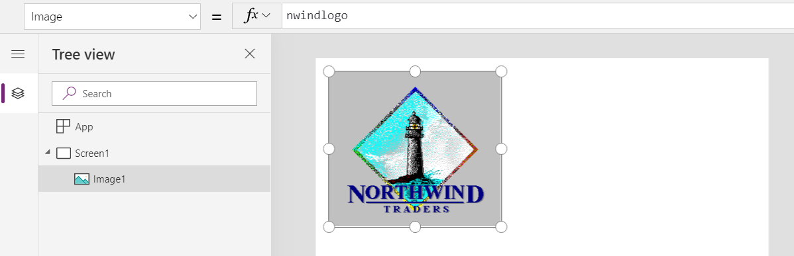
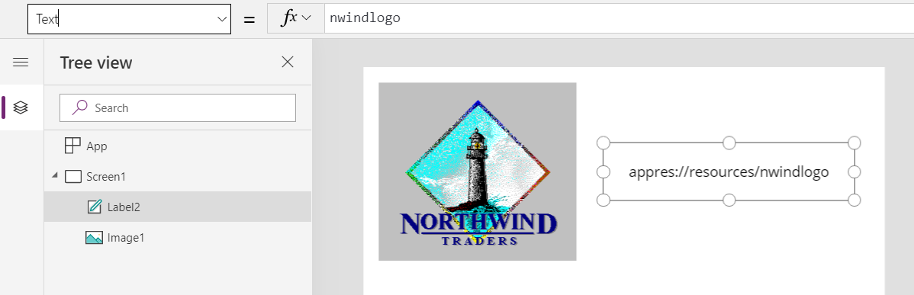
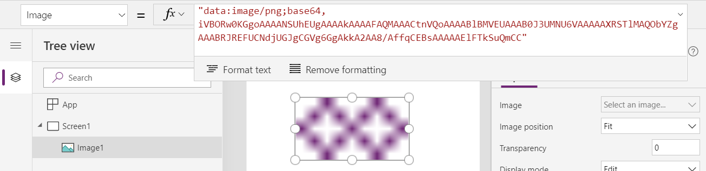

# Data types

*NOTE: Power Fx is the new name for canvas apps formula language.  These articles are work in progress as we extract the language from canvas apps, integrate it with other products of the Power Platform, and make available as open source.  Start with the [Power Fx Overview](overview.md) for an introduction to the language.   *

Information flows through Power Fx in small, discrete values, very much like the cells of a spreadsheet. For example, data in a **Birthday** field and an **Anniversary** field would both flow through as a **Date** value that includes the year, the month, and the day. The app knows how to format these values, constrain input to what is appropriate for each, and share the values with a database. Birthdays differ from anniversaries to people, but the system handles them in exactly the same manner. In this case, **Date** is an example of a [data type](https://en.wikipedia.org/wiki/Data_type).

This article provides details for the data types that Power Fx supports. When external data is brought into the language, each data type in that source is mapped to a data type for Power Fx.

| Data type | Description | Examples |
|-----------|-------------|---------|
| **Boolean** | A *true* or *false* value.  Can be used directly in **If**, **Filter** and other functions without a comparison.  | *true* |
| **Color** | A color specification, including an alpha channel. | **Color.Red**<br>**ColorValue( "#102030" )**<br>**RGBA( 255, 128, 0, 0.5 )** |
| **Currency** | A currency value that's stored in a floating-point number. Currency values are the same as number values with currency-formatting options.  | **123**<br>**4.56** |
| **Date** | A date without a time, in the time zone of the app's user. | **Date( 2019, 5, 16 )** |
| **DateTime** | A date with a time, in the time zone of the app's user. | **DateTimeValue( "May 16, 2019 1:23:09 PM" )** |
| **GUID** | A [Globally Unique Identifier](https://en.wikipedia.org/wiki/Universally_unique_identifier). | **GUID()**<br>**GUID( "123e4567-e89b-12d3-a456-426655440000" )** |
| **Hyperlink** | A text string that holds a hyperlink. | **"https://powerapps.microsoft.com"** |
| **Image** | A [Universal Resource Identifier (URI)](https://en.wikipedia.org/wiki/Uniform_Resource_Identifier) text string to an image in .jpeg, .png, .svg, .gif, or other common web-image format. | **MyImage** added as an app resource<br>**"https://northwindtraders.com/logo.jpg"**<br>**"appres://blobmanager/7b12ffa2..."** |
| **Media** | A URI text string to a video or audio recording. | **MyVideo** added as an app resource<br>**"https://northwindtraders.com/intro.mp4"**<br>**"appres://blobmanager/3ba411c..."** |
| **Number** | A floating-point number. | **123**<br>**-4.567**<br>**8.903e121** |
| **Option set** | A choice from a set of options, backed by a number. This data type combines a localizable text label with a numeric value. The label appears in the app, and the numeric value is stored and used for comparisons. | **ThisItem.OrderStatus** |
| **Record** | A record of data values. This compound data type contains instances of other data types that are listed in this topic. More information: [Working with tables](../working-with-tables.md). | **{ Company: "Northwind Traders",<br>Staff: 35, <br>NonProfit: false }** |
| **Record reference** | A reference to a record in an entity. Such references are often used with polymorphic lookups. More information: [Working with references](../working-with-references.md).| **First(Accounts).Owner** |
| **Table** | A table of records.  All of the records must have the same names for their fields with the same data types, and omitted fields are treated as *blank*. This compound data type contains instances of other data types that are listed in this topic. More information: [Working with tables](../working-with-tables.md). | **Table( { FirstName: "Sidney",<br>LastName: "Higa" }, <br>{ FirstName: "Nancy",<br>LastName: "Anderson" } )**
| **Text** | A Unicode text string. | **"Hello, World"** |
| **Time** | A time without a date, in the time zone of the app's user. | **Time( 11, 23, 45 )** |
| **Two option** | A choice from a set of two options, backed by a boolean value. This data type combines a localizable text label with a boolean value. The label appears in the app, and the boolean value is stored and used for comparisons. | **ThisItem.Taxable** |

Many of these data types are similar and have the same underlying representation, such as a **Hyperlink** field being treated as **Text**.  The additional data types provide better default experiences in forms and other controls.

## Blank

All data types can have a value of *blank* (in other words, no value). The term "null" is often used in databases for this concept.  

Use the **Blank** function with the **Set** or **Patch** function to set a variable or field to *blank*. For example, **Set( x, Blank() )** removes any value in the global variable **x**.  

Test for a *blank* value by using the [**IsBlank**](function-isblank-isempty.md) function. Replace possible *blank* values with non-*blank* values by using the [**Coalesce**](function-isblank-isempty.md) function.

Because all data types support *blank*, the **Boolean** and **Two option** data types effectively have three possible values.

## Text, Hyperlink, Image, and Media

All four of these data types are based on a [Unicode](https://en.wikipedia.org/wiki/Unicode) text string.

### Embedded text

Embedded text strings in a formula are enclosed in double quotation marks.  Use two double quotes together to represent a single double quote in the text string.  For example, using the following formula in the **OnSelect** property of a [**Button**](../controls/control-button.md) control:

```powerapps-dot
Notify( "Jane said ""Hello, World!""" )
```

results in a banner when the button is pressed, where the first and last double quotes are omitted (as they delimit the text string) and the repeated double quotes around **Hello, World!** are replaced with a single double quote:



Single quotation marks are not used for [identifier names](operators.md#identifier-names) that contain special characters and have no significance within a text string.  

### Image and Media resources

Through the **File** menu, you can add image, video, and audio files as app resources. The name of the imported file becomes the resource name in the app. In this graphic, the Northwind Traders logo, which is named **nwindlogo**, has been added to an app:



To use this resource in an app, specify it in the **Image** property of an [**Image**](../controls/control-image.md) control:



### URIs for images and other media

You can dig a little deeper into that last example by setting the **Text** property of a [**Label**](../controls/control-text-box.md) control to **nwindlogo**. The label shows a text string:



Power Fx references each image or other media file, whether it's in the cloud or added as an app resource, by a URI text string.

For example, the **Image** property of an image control accepts not only app resources but also links to images on the web, such as "https://northwindtraders.com/logo.jpg". The property also accepts inline images that use the [data URI scheme](https://en.wikipedia.org/wiki/Data_URI_scheme), as in this example:

```powerapps-dot
"data:image/png;base64,iVBORw0KGgoAAAANSUhEUgAAAAkAAAAFAQMAAACtnVQoAAAABlBMVEUAAAB0J3UMNU6VAAAAAXRSTlMAQObYZgAAABRJREFUCNdjUGJgCGVg6GgAkkA2AA8/AffqCEBsAAAAAElFTkSuQmCC"
```

That URI displays a scaled-up version of two purple diamonds:



You can show the most recent image captured in a [**Camera**](../controls/control-camera.md) control if you set the **Image** property of an image control to the **Photo** property of the camera control. The app holds the image in memory, and the **Photo** property of the camera control returns a URI reference to the image. For example, you might take a picture, and the camera's **Photo** property could return **"appres://blobmanager/7b12ffa2ea4547e5b3812cb1c7b0a2a0/1"**.

You use a URI to reference an image or another media file stored in a database. That way, the app doesn't retrieve the actual data until it's needed. For example, an attachment in a Microsoft Dataverse entity might return **"appres://datasources/Contacts/table/..."** As in the camera example, you can display this image by setting the **Image** property of an image control to this reference, which retrieves the binary data.

When you save a media data type, such as an image, to a database, the app sends the actual image or media data, not the URI reference.

### Size limits

As text strings and URIs, these data types have no preset limit on their length.

The binary data that these data types reference also has no preset limit on size. For example, an image captured through the camera control that's now referenced as **"appres://..."** can be as large and high resolution as the device's camera can muster. The resolution, frame rate, and other attributes of media files aren't limited by the data type, but specific controls for playing and capturing media may have their own limitations.

However, all data sizes are subject to the amount of available memory in the app. Browsers running on a desktop computer typically support more than 100 megabytes of data. However, the amount of available memory on a device such as a phone might be far lower, typically in the range 30-70 megabytes. To determine whether your app will run within these limits, test common scenarios on all devices on which it should run.

As a best practice, hold data in memory only as long as necessary. Upload images to a database as soon as you can; download images only when the app's user requests them.

## Number and Currency

**Number** and **Currency** data types use the [IEEE 754 double-precision floating-point standard](https://en.wikipedia.org/wiki/IEEE_754). This standard provides a large range of numbers in which to work, from –1.79769 x 10<sup>308</sup> to 1.79769 x 10<sup>308</sup>. The smallest value that can be represented is 5 x 10<sup>–324</sup>.

Power Fx can exactly represent whole numbers (or integers) between –9,007,199,254,740,991 (–(2<sup>53</sup> – 1)) and 9,007,199,254,740,991 (2<sup>53</sup> – 1), inclusive. This range is larger than the 32-bit (or 4-byte) integer data types that databases commonly use. However, Power Fx can't represent 64-bit (or 8-byte) integer data types. You might want to store the number in a text field or use a calculated column to make a copy of the number in a text field, so that it's mapped into a **Text** data type in Power Fx. In this manner, you can hold, display, and enter these values, and comparing them to determine whether they're equal; however, you can't perform numerical calculations on them in this form.

Floating-point arithmetic is approximate, so it can sometimes give unexpected results with many documented examples. You might expect the formula **55 / 100 * 100** to return exactly 55 and **(55 / 100 * 100) - 55** to return exactly zero. However, the latter formula returns 7.1054 x 10<sup>–15</sup>, which is small but not zero. That tiny difference doesn't normally cause a problem, and the app rounds it away when showing the result. However, small differences can compound in subsequent calculations and appear to give the wrong answer.

Database systems often store currencies and perform calculations by using decimal math, which offers a smaller range but greater control over the precision. By default, Power Fx apps map currencies in and out of floating-point values; therefore, the result might differ from calculations that are done in a native decimal data type. If this type of discrepancy will cause problems, you might want to work with these values as **Text**, just as you might with large integers described earlier in this section.

## Date, Time, and DateTime

### Time zones

Date/time values fall in these categories:

- **User local**: These values are stored in [UTC (Coordinated Universal Time)](https://en.wikipedia.org/wiki/Coordinated_Universal_Time), but the app user's time zone affects how the app shows these values and how the app user specifies them. As an example, the same moment appears differently to a user in Canada than it does to a user in Japan.
- **Time zone independent**: The app shows these values the same way and the app user specifies them the same way, regardless of time zone. The same moment appears the same way to a user in Canada as it does to a user in Japan. App authors who don't expect their apps to run in different time zones use these values because they're simpler overall.

This table shows some examples:

| Date/time type | Value stored in the database | Value displayed and entered 7 hours west of UTC | Value displayed and entered 4 hours east of UTC |
|--------------------------|------------------------------|------------------------------|
| **User local** | Sunday,&nbsp;May&nbsp;19,&nbsp;2019<br>4:00 AM | Saturday,&nbsp;May&nbsp;18,&nbsp;2019<br>9:00 PM | Sunday,&nbsp;May&nbsp;19,&nbsp;2019<br>8:00 AM |
| **Time zone independent** | Sunday,&nbsp;May&nbsp;19,&nbsp;2019<br>4:00 AM | Sunday,&nbsp;May&nbsp;19,&nbsp;2019<br>4:00 AM | Sunday,&nbsp;May&nbsp;19,&nbsp;2019<br>4:00 AM | 

When used in Power Apps, for **User local** date/times, Power Fx uses the time zone of the browser or device, but model-driven apps use the user's setting in Dataverse. These settings typically match, but results will differ if these settings differ.

Use the [**DateAdd**](function-dateadd-datediff.md) and [**TimeZoneInformation**](function-dateadd-datediff.md) functions to convert local time to UTC and back again.  See the examples at the end of the documentation for these functions.

### Numeric equivalents

Power Fx holds and calculates all date/time values, whether **User local** or **Time zone independent** in UTC. The app translates the values based on the app user's time zone when showing them and when the app user specifies them.

When Power Fx reads a **Time zone independent** value from a data source or writes such a value to a data source, the app automatically adjusts the value to compensate for the time zone of the app's user. The app then treats the value as a UTC value, consistent with all other date/time values in the app. Because of this compensation, the original **Time zone independent** value appears when the app adjusts the UTC value for the app user's time zone.

You can observe this behavior more closely by using the [**Value**](function-value.md) function to access the underlying numerical value for a date/time value. This function returns the date/time value as the number of milliseconds since January 1, 1970 00:00:00.000 UTC.

Because every date/time value is held in UTC, the formula **Value( Date( 1970, 1, 1 ) )** won't return zero in most parts of the world because the **Date** function returns a date in UTC. For example, the formula would return 28,800,000 in a time zone that's offset from UTC by eight hours. That number reflects the number of milliseconds in eight hours.

Returning to our example from above:

| Date/time type | Value stored in the database | Value displayed and entered 7 hours west of UTC | **Value** function returns |
|--------------------------|------------------------------|------------------------------|
| **User local** | Sunday,&nbsp;May&nbsp;19,&nbsp;2019<br>4:00 AM | Saturday,&nbsp;May&nbsp;18,&nbsp;2019<br>9:00 PM | 1,558,238,400,000<br> (Sunday,&nbsp;May&nbsp;19,&nbsp;2019<br>4:00 AM UTC) |
| **Time zone independent** | Sunday,&nbsp;May&nbsp;19,&nbsp;2019<br>4:00 AM | Sunday,&nbsp;May&nbsp;19,&nbsp;2019<br>4:00 AM |1,558,263,600,000<br> (Sunday,&nbsp;May&nbsp;19,&nbsp;2019<br>11:00 AM UTC) |

### Converting Unix times

Unix times reflect the number of seconds since January 1, 1970 00:00:00 UTC. Because Power Fx uses milliseconds instead of seconds, you can convert between the two by multiplying or dividing by 1,000.

For example, Unix time shows September 9, 2001, at 01:46:40 UTC as 1,000,000,000. To show that date/time value as text, multiply that number by 1,000 to convert it to milliseconds, and then use it in a [**Text**](function-text.md) function. The formula **Text( 1000000000 * 1000, DateTimeFormat.UTC )** returns the string **2001-09-09T01:46:40.000Z**.

However, that function returns **Saturday, September 8, 2001 18:46:40** if you use the **DateTimeFormat.LongDateTime24** format in a time zone that's -7 hours offset from UTC (7 hours west of UTC). This result shows the **DateTime** value correctly based on the local time zone.

To convert to a Unix time, divide the result from **Value** by 1,000:
<br>**RoundDown( Value( UnixTime ) / 1000, 0 )**

If you need the Unix time in a **Date** value for further calculations or display within Power Apps, use this formula:
<br>**DateAdd( Date( 1970,1,1 ), UnixTime, Seconds )**

### SQL Server

SQL Server has [**Datetime**, **Datetime2**, and other date/time data types](https://docs.microsoft.com/sql/t-sql/functions/date-and-time-data-types-and-functions-transact-sql?view=sql-server-2017) that don't include a time-zone offset and don't indicate which time zone they're in. Power Fx assumes these values are stored in UTC and treat them as **User local**. If the values are meant to be,  time-zone independent, correct for the UTC translations by using the [**TimeZoneOffset**](function-dateadd-datediff.md#converting-to-utc) function.

Power Fx uses the included time-zone information in **Datetimeoffset** fields when converting a value to the app's internal UTC representation. The apps always use UTC as the time zone (zero time zone offset) when they write data.

Power Fx reads and writes values of the [**Time**](https://docs.microsoft.com/sql/t-sql/data-types/time-transact-sql) data type in SQL Server as text strings in the [ISO 8601 duration format](https://en.wikipedia.org/wiki/ISO_8601#Durations). For example, you must parse this string format and use the [**Time**](function-date-time.md) function to convert the text string **"PT2H1M39S"** to a **Time** value:

```powerapps-dot
With( 
    Match( "PT2H1M39S", "PT(?:(?<hours>\d+)H)?(?:(?<minutes>\d+)M)?(?:(?<seconds>\d+)S)?" ),
    Time( Value( hours ), Value( minutes ), Value( seconds ) )
)
// Result: 2:01 AM (as shown in a label control, use the Text function to see the seconds)

```

### Mixing date and time information

**Date**, **Time**, and **DateTime** have different names, but they all hold the same information about dates and times. 

A **Date** value can include time information with it, which is usually midnight. A **Time** value can carry date information, which is usually January 1, 1970. Dataverse also stores time information with a **Date Only** field but shows only the date information by default. Similarly, Power Fx sometimes distinguish between these data types to determine default formats and controls.

Adding and subtracting date and time values directly isn't recommended because time-zone and other conversions could cause confusing results. Either use the **Value** function to convert date/time values to milliseconds first and take into account the app user's time zone, or use the [**DateAdd**](function-dateadd-datediff.md) and [**DateDiff**](function-dateadd-datediff.md) functions to add or subtract from one of these values.

## Option sets and Two options

Option sets and two-option data types provide a two or more choices for an app user to select. For example, an **Order Status** option set might offer the choices **New**, **Shipped**, **Invoiced**, and **Closed**. The two-option data type offers only two choices.

Both of these data types show their labels in a text-string context. For example, a label control shows one of the order-status options if the control's **Text** property is set to a formula that references that option set. Option labels might be localized for app users in different locations.

When an app user selects an option and saves that change, the app transmits the data to the database, which stores that data in a representation that's independent of language. An option in an option set is transmitted and stored as a number, and an option in a two-option data type is transmitted and stored as a boolean value.

The labels are for display purposes only. You can't perform direct comparisons with the labels because they're specific to a language. Instead, each option set has an enumeration that works with the underlying number or boolean value. For example, you can't use this formula:

`If( ThisItem.OrderStatus = "Active", ...`

But you can use this formula:

`If( ThisItem.OrderStatus = OrderStatus.Active, ...`

For global option sets (which entities share), the name of the option-set enumeration matches the name of the global option set. For local option sets (which are scoped to an entity), the name might contain the name of the entity. This behavior avoids conflicts if multiple entities have option sets that have the same name. For example, the **Accounts** entity might have an **OrderStatus** option set, and its name might be **OrderStatus (Accounts)**. That name contains one or more spaces and parentheses, so you must surround it with single quotation marks if you reference it in a formula.

In addition, two-option values can also behave as boolean values. For example, a two-option value named **TaxStatus** might have the labels **Taxable** and **Non-Taxable**, which correspond to *true* and *false* respectively. To demonstrate, you can use this formula:

`If( ThisItem.Taxable = TaxStatus.Taxable, ...`

You can also use this equivalent formula:

`If( ThisItem.Taxable, ...`
