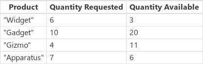

---
title: ForAll and Map functions
description: Reference information including syntax and examples for the ForAll function.
author: gregli-msft

ms.topic: reference
ms.custom: canvas
ms.reviewer: mkaur
ms.date: 6/10/2024
ms.subservice: power-fx
ms.author: gregli
search.audienceType:
  - maker
contributors:
  - gregli-msft
  - mduelae
  - gregli
no-loc: ["ForAll"]
---

# ForAll and Map functions
[!INCLUDE[function-forall-applies-to](includes/function-forall-applies-to.md)]


Calculates values and performs actions for all the [records](/power-apps/maker/canvas-apps/working-with-tables#records) in a [table](/power-apps/maker/canvas-apps/working-with-tables).

## Description

The **ForAll** and **Map** functions evaluates a formula for all the records in a table. The formula can calculate a value, returning the result for each record in a result table. **ForAll** can also perform actions, such as modifying data or working with a connection. Use the [**With** function](function-with.md) to evaluate the formula for a single record.

Use the [**Sequence** function](function-sequence.md) with the **ForAll** function to iterate based on a count.

[!INCLUDE [record-scope](../../includes/record-scope.md)]

### Return value

The result of each formula evaluation is returned in a table, in the same order as the input table.

If the result of the formula is a single value, the resulting table is a single-column table. If the result of the formula is a record, the resulting table contains records with the same columns as the result record.

If the result of the formula is a _blank_ value, then there's no record in the result table for that input record. In this case, there are fewer records in the result table than the source table.

### Taking action

The **ForAll** formula can include functions that take action, such as modifying the records of a data source with the **[Patch](function-patch.md)** and **[Collect](function-clear-collect-clearcollect.md)** functions. The formula can also call methods on connections. Multiple actions can be performed per record by using the [**;** operator](operators.md). You can't modify the table that is the subject of the **ForAll** function.

**ForAll** processes records in the same order in which they appear in the original table, first to last. The **Map** does not support any behavior functions in its formula. It is designed for parallel evaluation and does not guarantee the order of evaluation.

Several functions that modify data sources, including **Collect**, **Remove**, and **Update**, return the changed data source as their return value. These return values can be large and consume significant resources if returned for every record of the **ForAll** table. If the return value from **ForAll** isn't used, which is often the case with data modification functions, then the return value won't be created and there are no resource or order concerns. But if you're using the result of a **ForAll** and one of the functions that returns a data source, think carefully about how you structure the result and try it out first on small data sets.

### Combining tables

The **Map** function can step through the records of multiple tables at the same time, useful for combinging values from multiple tables into one. Some other programming languages refer to this as a "Zip" operation.

To avoid confusion, if more than one table is provided, each table must be named with the `As` operator.

Use the **MapLength** optional argument to specify the length of the resulting table if the tables are of different lengths. 

| MapLength enum | Description |
|----------------|-------------|
| MapLength.Equal | All tables must be the same length, otherwise a runtime error is produced. (default) |
| MapLength.First | The result table will be the same length as the first table in the argument list. |
| MapLength.Shortest | The result table will be the same length as the shortest table. |
| MapLength.Longest | The result table will be the same length as the longest table. |

If one of the input tables isn't as long as the resulting table, *blank* values are used for the missing records.

### Dynamic values

Input tables for both **ForAll** and **Map** can be Dynamic values such as are generated by the **ParseJSON** function. The top element of the Dynamic value must be an array or table.

Standard strongly typed tables, such as produced by the **Table** function, cannot be mixed with Dynamic values.

### Alternatives

Many functions in Power Fx can process more than one value at a time by using a single-column table. For example, the **Len** function can process a table of text values, returning a table of lengths, in the same manner, that **ForAll** or **Map** could. This can eliminate the need to use **ForAll** or **Map** in many cases, can be more efficient and easier to read.

Another consideration is that **ForAll** and **Map** aren't delegable while other functions may be, such as **Filter**.

### Delegation

[!INCLUDE [delegation-no-two](../../includes/delegation-no-two.md)]

## Syntax

**ForAll**(_Table_ [**As** _TableName_], _Formula_)

- _Table_ - Required. Table to be acted upon.
- _TableName_ - Optional. Name to use in the _Formula_ when referring to _Table_, helpful to disambiguate in nested situations. Default is **ThisRecord**.
- _Formula_ - Required. The formula to evaluate for all records of the _Table_.

**Map**(_Table_ [**As** _TableName_], _Formula_)

- _Table_ - Required. Table to be acted upon.
- _TableName_ - Optional. Name to use in the _Formula_ when referring to _Table_, helpful to disambiguate in nested situations. Default is **ThisRecord**.
- _Formula_ - Required. The formula to evaluate for all records of the _Table_.

**Map**(_Table1_ **As** _Table1Name_, _Table2_ **As** _Table2Name_ [, _Table3_ **As** _Table3Name_, ...], _Formula_ [, _MapLength_ ])

- _Tables_ - Required. Two or more tables to be combined.
- _TableNames_ - Required. Names to use in the _Formula_ when referring to _Tables_. 
- _Formula_ - Required. The formula to evaluate for all records of the _Tables_.
- _MapLength_ - Optional. Specifies the resulting table length if the input tables are of different lengths.

## Examples

### Calculations

The following examples use the **Squares** [data source](/power-apps/maker/canvas-apps/working-with-data-sources):


To create this data source as a collection, set the **OnSelect** property of a **Button** control to this formula, open Preview mode, and then select the button:

`ClearCollect( Squares, [ "1", "4", "9" ] )`

| Formula                                                                                       | Description                                                                                                                                                                                                                      | Result                                                 |
| --------------------------------------------------------------------------------------------- | -------------------------------------------------------------------------------------------------------------------------------------------------------------------------------------------------------------------------------- | ------------------------------------------------------ |
| **ForAll(&nbsp;Squares, Sqrt(&nbsp;Value&nbsp;)&nbsp;)**<br><br>**Sqrt(&nbsp;Squares&nbsp;)** | For all the records of the input table, calculates the square root of the **Value** column. The **Sqrt** function can also be used with a single-column table, making it possible to perform this example without using **ForAll**. |     |
| **ForAll(&nbsp;Squares, Power(&nbsp;Value,&nbsp;3&nbsp;)&nbsp;)**<br><br>**Map(&nbsp;Squares, Power(&nbsp;Value,&nbsp;3&nbsp;)&nbsp;)**                             | For all the records of the input table, raises the **Value** column to the third power. The **Power** function doesn't support single-column tables, therefore **ForAll** or **Map** must be used in this case.                           |  |

### Using a connection

The following examples use the **Expressions** [data source](/power-apps/maker/canvas-apps/working-with-data-sources):


To create this data source as a collection, set the **OnSelect** property of a **Button** control to this formula, open Preview mode, and then select the button:

`ClearCollect( Expressions, [ "Hello", "Good morning", "Thank you", "Goodbye" ] )`

This example also uses a [Microsoft Translator](/power-apps/maker/canvas-apps/connections/connection-microsoft-translator) connection. To add this connection to your app, see the article about how to [manage connections](/power-apps/maker/canvas-apps/add-manage-connections).

| Formula                                                              | Description                                                                                                                   | Result                                                              |
| -------------------------------------------------------------------- | ----------------------------------------------------------------------------------------------------------------------------- | ------------------------------------------------------------------- |
| **ForAll(Expressions, MicrosoftTranslator.Translate(Value, "es"))** | For all the records in the Expressions table, translate the contents of the **Value** column into Spanish (abbreviated "es"). |  |
| **ForAll(Expressions, MicrosoftTranslator.Translate(Value, "fr"))** | For all the records in the Expressions table, translate the contents of the **Value** column into French (abbreviated "fr").  |  |

### Copying a table

Sometimes you need to filter, shape, sort, and manipulate data. Power Apps provides many functions for doing this, such as **Filter**, **AddColumns**, and **Sort**. Power Apps treats each table as a value, allowing it to flow through formulas and be consumed easily.

And sometimes you want to make a copy of this result for later use, or you want to move information from one data source to another. Power Apps provides the **Collect** function to copy data.

But before you make that copy, think carefully if it's needed. Many situations can be addressed by filtering and shaping the underlying data source on-demand with a formula. Some of the downsides to making a copy include:

- Two copies of the same information mean that one of them can fall out of sync.
- Making a copy can consume much of the computer memory, network bandwidth, and/or time.
- For most data sources, copying can't be delegated, limiting how much data can be moved.

The following examples use the **Products** [data source](/power-apps/maker/canvas-apps/working-with-data-sources):



To create this data source as a collection, set the **OnSelect** property of a **Button** control to this formula, open Preview mode, and then select the button:

```power-fx
ClearCollect( Products,
    Table(
        { Product: "Widget",    'Quantity Requested': 6,  'Quantity Available': 3 },
        { Product: "Gadget",    'Quantity Requested': 10, 'Quantity Available': 20 },
        { Product: "Gizmo",     'Quantity Requested': 4,  'Quantity Available': 11 },
        { Product: "Apparatus", 'Quantity Requested': 7,  'Quantity Available': 6 }
    )
)
```

Our goal is to work with a derivative table that includes only the items where more has been requested than is available, and for which we need to place an order:


We can perform this task in a couple of different ways, all of which produce the same result, with various pros and cons.

#### Table shaping on demand

Don't make that copy! We can use the following formula anywhere we need:

```power-fx
// Table shaping on demand, no need for a copy of the result
ShowColumns(
    AddColumns(
        Filter( Products, 'Quantity Requested' > 'Quantity Available' ),
        "Quantity To Order", 'Quantity Requested' - 'Quantity Available'
    ),
    "Product",
    "Quantity To Order"
)
```

A [record scope](/power-apps/maker/canvas-apps/working-with-tables#record-scope) is created by the **Filter** and **AddColumns** functions to perform the comparison and subtraction operations, respectively, with the **'Quantity Requested'** and **'Quantity Available'** fields of each record.

In this example, the **Filter** function can be delegated. This is important, as it can find all the products that meet the criteria, even if that is only a few records out of a table of millions. At this time, **ShowColumns** and **AddColumns** cannot be delegated, so the actual number of products that need to be ordered is limited. If you know the size of this result is always be relatively small, this approach is fine.

And because we didn't make a copy, there's no extra copy of the information to manage or fall out of date.

#### ForAll on demand

Another approach is to use the **Map** function to replace the table-shaping functions:

```powerapps-dot
Map( Products,
    If( 'Quantity Requested' > 'Quantity Available',
        {
            Product: Product,
            'Quantity To Order': 'Quantity Requested' - 'Quantity Available'
        }
    )
)
```

This formula may be simpler for some people to read and write.

No part of the **Map** is delegable. Only the first portion of the **Products** table is evaluated, which could be a problem if this table is large. Because **Filter** could be delegated in the previous example, it could work better with large data sets.

We can also take the output of the **Filter** function and **Map** it to the result we desire, replacing **ShowColumns** and **AddColumns** with a single **Map**:

```powerapps-dot
Map( Filter( Products,
             'Quantity Requested' > 'Quantity Available' ),
     {
        Product: Product,
        'Quantity To Order': 'Quantity Requested' - 'Quantity Available'
     }
)

```

#### Collect the result

In some situations, a copy of data may be required. You may need to move information from one data source to another. In this example, orders are placed through a **NewOrder** table on a vendor's system. For high-speed user interactions, you may want to cache a local copy of a table so that there's no server latency.

We use the same table shaping as the previous two examples, but we capture the result into a collection:

```power-fx
ClearCollect( NewOrder,
    ShowColumns(
        AddColumns(
            Filter( Products, 'Quantity Requested' > 'Quantity Available' ),
            "Quantity To Order", 'Quantity Requested' - 'Quantity Available'
        ),
        "Product",
        "Quantity To Order"
    )
)
```

```power-fx
ClearCollect( NewOrder,
    ForAll( Products,
        If( 'Quantity Requested' > 'Quantity Available',
            {
                Product: Product,
                'Quantity To Order': 'Quantity Requested' - 'Quantity Available'
            }
        )
    )
)
```

**ClearCollect** and **Collect** can't be delegated. As a result, the amount of data that can be moved in this manner is limited.

#### Collect within ForAll

Finally, we can perform the **Collect** directly within the **ForAll**:

```power-fx
Clear( NewOrder );
ForAll( Products,
    If( 'Quantity Requested' > 'Quantity Available',
        Collect( NewOrder,
            {
                Product: Product,
                'Quantity To Order': 'Quantity Requested' - 'Quantity Available'
            }
        )
    )
)
```

Again, the **ForAll** function can't be delegated at this time. If our **Products** table is large, **ForAll** looks at the first set of records only and we may miss some products that need to be ordered. But for tables that we know are remain small, this approach is fine.

Note that we aren't capturing the result of the **ForAll**. The **Collect** function calls made from within it returns the **NewOrder** data source for all the records, which could add up to numerous data if we were capturing it.

### Map table in a component

See [Map tables](/power-apps/maker/canvas-apps/map-component-input-fields#map-tables).

[!INCLUDE[footer-include](../../includes/footer-banner.md)]


