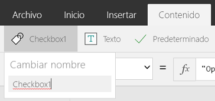

# Global support

> [!NOTE]
> Power Fx is the new name for canvas apps formula language.  These articles are work in progress as we extract the language from canvas apps, integrate it with other products of the Power Platform, and make available as open source.  Start with the [Power Fx Overview](overview.md) for an introduction to the language.    

Power Fx is a global product. You can build and use the programming language in many different languages and regions.

Both while building and running logic, the text displayed by Power Fx will be displayed in the appropriate languages. Typing in and displaying dates and numbers is adapted for your particular language and region.  

For example, some regions of the world use a **.** (dot or period) as the decimal separator while others use a **,** (comma).  This is what Excel does too.  This is commonly not done in other programming languages, using a canonical **.** as the decimal separator for all users worldwide.  To be as approachable as possible for makers at all levels, it is important that `3,14` is a decimal number for a person in France who has used that syntax all their lives.   

The apps you create can be globally aware as well.  Use the **Language**, **Text**, and **Value**, **DateValue**, and other functions to adapt what is displayed and used as input in different languages.   

## Language settings

When using the native studio or a native player, the language used is provided by the host operating system. For Windows, this setting can be controlled under "All Settings" and then "Time & language" settings.  Windows also allows you to specify the characters to use for the decimal separator, overriding the language setting.  

When using the web experiences, the language used is provided by the browser.  Most browser default to the host operating system's setting with some also providing a way to set the language manually.

## Authoring environment

The authoring environment adapts to the language setting of the author.  The app itself is stored in a language agnostic manner, so that authors using different languages can edit the same app.

### Names in formulas

Most elements in formula are always in English:

* Function names: **If**, **Navigate**, **Collect**, and so on.
* Control property names: **Screen.Fill**, **Button.OnSelect**, **Textbox.Font**, and so on.
* Enumeration names: **Color.Aqua**, **DataSourceInfo.MaxValue**, **FontWeight.Bold**, and so on.
* Signal records: **Compass.Heading**, **Location. Latitude**, **App.ActiveScreen**, and so on.
* Operators: **Parent**, **in**, **exactIn**, and so on.

As the authoring experience is localized, control and other object names will appear in the native language of the author.  In Spanish, some of the control names appear as:


When you insert one of these controls into your app, their name will default to English.  This change is done for consistency with the control property names and the rest of the formula.  For example, **Casilla** listed above is inserted as **Checkbox1**.  

After a control is inserted, you can change the name to whatever you like.  While selected, the far left-hand side of the "Content" ribbon displays the name of the control.  Selecting this name drops down a text box where you can edit the name:



If you like, here you can rename the control to **Casilla1**.  The red squiggly, in this case displayed by a browser, is because the name isn't a Spanish word and is of no concern.

You can use whatever names you like for:

* Control names
* Collection names
* Context variable names

### Formula separators and chaining operator
Some [separators and operators](operators.md) will shift based on the decimal separator of the author's language:

| Author's language decimal separator | Power Apps decimal separator | Power Apps list separator | Power Apps chaining operator |
| --- | --- | --- | --- |
| **.** (dot or period) |**.** (dot or period) |**,** (comma) |**;** (semi-colon) |
| **,** (comma) |**,** (comma) |**;** (semi-colon) |**;;** (double semi-colon) |

The change in the Power Apps list separator is consistent with what happens to the Excel list separator.  It impacts:

* Arguments in function calls.
* Fields in a [record](tables.md#elements-of-a-table).
* Records in a [table](tables.md#inline-value-tables).

For example, consider the following formula expressed in a language and region that uses dot or period as the decimal separator, such as Japan or the United Kingdom:


Now view this same formula in a language and region where a comma is used for the decimal separator, such as France or Spain:


The highlight shows the operators that change between the two versions. The property selection operator **.** (dot or period) in **Slider1.Value** is always the same, no matter what the decimal separator is.

Internally the formula doesn't change, all that changes is how it's displayed and edited by the author.  Two different authors using two different languages can view and edit the same formula, with each seeing the appropriate separators and operators for their language.

## Creating a global app
The app you create can adapt to different languages, providing a great user experience for your users around the world.

### Language function
The **Language** function returns the language tag of the current user.  For example, this function returns **"en-GB"** for users in Great Britain and **"de-DE"** for users in Germany.  

Among other things, you can use **Language** to display translated text for your users.  Your app can include a table of translated values in your app:


And then use a formula such as the following to pull translated strings from the table:

```powerapps-dot
LookUp( Table1, TextID = "Hello" && (LanguageTag = Left( Language(), 2 ) || IsBlank( LanguageTag ))).LocalizedText
```

Translated strings in other languages could be longer than they are in your language.  In many cases, the labels and other elements that display the strings in your user interface will need to be wider to accommodate.

For more information, see the documentation for the **Language** function.

### Formatting numbers, dates, and times
Numbers, dates, and times are written in different formats in different parts of the world.  The meaning of commas, decimals, and the order of month, date, and year vary from location to location.   

The **Text** function formats numbers and dates using the language setting of the user.

**Text** requires a format string to know how you want to format the number or date.  This format string can take one of two forms:

* **A global aware enumeration.**  For example, **Text( Now(), DateTimeFormat.LongDate )**.  This formula will format the current date in a language appropriate format.  This method is the preferred way to specify the format string.
* **A custom format string.**  For example, **Text( Now(), "[$-en-US]dddd, mmmm dd, yyyy" )** displays the same text as the enumeration when used in the language "en-US".  The advantage of the custom format string is that you can specify exactly what you want.

The "[$-en-US]" on the front of the custom format string tells **Text** in which language to interpret the custom format string.  This string is inserted for you and defaults to your authoring language. Normally you won't need to change this string.  It's useful when authors from different languages are editing the same app.

The third argument to **Text** specifies which language to use for the result of the function.  The default is the language setting of the current user.

For more information, see the documentation for the **Text** function.      

### Reading numbers, dates, and times
There are four functions for reading numbers, dates, and times provided by the user:

* **Value**: Converts a number in a text string to a number value.
* **DateValue**: Converts a date value in a text string to a date/time value.  Anytime specified in the text string is ignored.
* **TimeValue**: Converts a time value in a text string to a date/time value.  Any date specified in the text string is ignored.
* **DateTimeValue**: Converts a date and time value in a text string to a date/time value.  

If you have used Excel, all of these functions are combined in the single **Value** function.  They're broken out here since Power Apps has separate types for date/time values and numbers.

All of these functions have the same arguments:

* *String, required*: A string from the user. For example, a string types into a **Text input** control and read from the control with the **Text** property.
* *Language, optional*: The language in which to interpret the *String*.  By default, the language setting of the user.

For example:

* **Value( "12,345.678", "en-US" )** or **Value( "12,345.678" )** when located where "en-US" is the user's language returns the number **12345.678**, ready for calculations.
* **DateValue( "1/2/01", "es-ES" )** or **DateValue( "1/2/01" )** when located where "es-ES" is the user's language returns the date/time value **February 1, 2001 at midnight**.
* **TimeValue( "11:43:02", "fr-FR" )** or **TimeValue( "11:43:02" )** when located where "fr-FR" is the user's language returns the date/time value **January 1, 1970 at 11:43:02**.
* **DateTimeValue( "11:43:02 1/2/01", "de-DE" )** or **DateTimeValue( "11:43:02 1/2/01" )** when located where "de-DE" is the user's language returns the date/time value **February 1, 2001 at 11:43:02**.

For more information, see the documentation for the **Value** and **DateValue, TimeValue, and DateTimeValue**  functions.

### Calendar and Clock information
The **Calendar** and **Clock** functions provide calendar and clock information for the user's current language.  

Among other things, use these functions to provide a **Dropdown** control with a list of choices.  

For more information, see the documentation for the **Calendar** and **Clock**  functions.

