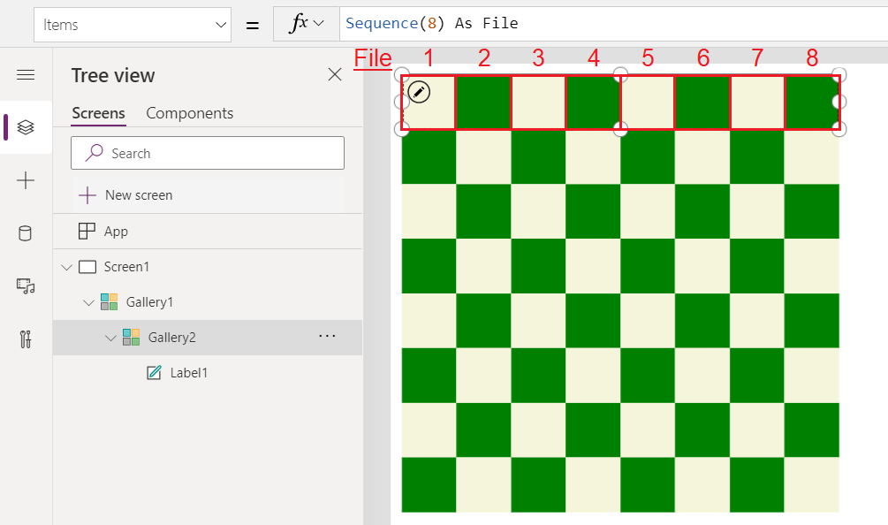

# Operators and Identifiers

Some of these operators are dependent on the language of the author.  See [Global apps](global-apps.md) for more information.


|                               Symbol                                |                        Type                         |                                                                                    Syntax                                                                                    |                                                                                                                           Description                                                                                                                            |
|---------------------------------------------------------------------|-----------------------------------------------------|------------------------------------------------------------------------------------------------------------------------------------------------------------------------------|------------------------------------------------------------------------------------------------------------------------------------------------------------------------------------------------------------------------------------------------------------------|
|                                **.**                                |                  Property Selector                  |                                                               **Slider1.Value<br>Color.Red**                                                               |                                               Extracts a property from a [table](../working-with-tables.md), control, or enumeration.  For backward compatibility, **!** may also be used.                                                |
| **.**<br>[[language dependent](../global-apps.md)]  |                  Decimal separator                  |                                                             **1.23**                                                           |                                                                              Separator between whole and fractional parts of a number. The character depends on the language.                                                                              |
|                               **( )**                               |                     Parentheses                     |                                                               **Filter(T, A &lt; 10)**<br><br>**(1 + 2) \* 3**                                                               |                                                                                           Enforces precedence order, and groups subexpressions in a larger expression                                                                                           |
|                                **+**                                |                Arithmetic operators                 |                                                                                  **1 + 2**                                                                                   |                                                                                                                             Addition                                                                                                                             |
|                                **-**                                |                       &nbsp;                        |                                                                                  **2 - 1**                                                                                   |                                                                                                                       Subtraction and sign                                                                                                                       |
|                              *                               |                       &nbsp;                        |                                                                                  **2 \* 3**                                                                                  |                                                                                                                          Multiplication                                                                                                                          |
|                                **/**                                |                       &nbsp;                        |                                                                                  **2 / 3**                                                                                   |                                                                                                   Division (also see the **[Mod](function-mod.md)** function)                                                                                                    |
|                                **^**                                |                       &nbsp;                        |                                                                                  **2 ^ 3**                                                                                   |                                                                                          Exponentiation, equivalent to the **[Power](function-numericals.md)** function                                                                                          |
|                                **%**                                |                       &nbsp;                        |                                                                                   **20%**                                                                                    |                                                                                                         Percentage (equivalent to &quot;\* 1/100&quot;)                                                                                                          |
|                                **=**                                |                Comparison operators                 |                                                                               **Price = 100**                                                                                |                                                                                                                             Equal to                                                                                                                             |
|                              **&gt;**                               |                       &nbsp;                        |                                                                              **Price &gt; 100**                                                                              |                                                                                                                           Greater than                                                                                                                           |
|                              **&gt;=**                              |                       &nbsp;                        |                                                                             **Price &gt;= 100**                                                                              |                                                                                                                     Greater than or equal to                                                                                                                     |
|                              **&lt;**                               |                       &nbsp;                        |                                                                              **Price &lt; 100**                                                                              |                                                                                                                            Less than                                                                                                                             |
|                              **&lt;=**                              |                       &nbsp;                        |                                                                             **Price &lt;= 100**                                                                              |                                                                                                                      Less than or equal to                                                                                                                       |
|                            **&lt;&gt;**                             |                       &nbsp;                        |                                                                            **Price &lt;&gt; 100**                                                                            |                                                                                                                           Not equal to                                                                                                                           |
|                              **&amp;**                              |            String concatenation operator            |                                                      **&quot;hello&quot; &amp; &quot; &quot; &amp; &quot;world&quot;**                                                       |                                                                                                             Makes multiple strings appear continuous                                                                                                             |
|                      **&amp;&amp;** or **And**                      |                  Logical operators                  |                                       **Price &lt; 100 &amp;&amp; Slider1.Value = 20**<br>or **Price &lt; 100 And Slider1.Value = 20**                                       |                                                                                         Logical conjunction, equivalent to the **[And](function-logicals.md)** function                                                                                          |
|                     **&#124;&#124;** or **Or**                      |                       &nbsp;                        |                                        **Price &lt; 100 &#124;&#124; Slider1.Value = 20** or **Price &lt; 100 Or Slider1.Value = 20**                                        |                                                                                          Logical disjunction, equivalent to the **[Or](function-logicals.md)** function                                                                                          |
|                          **!** or **Not**                           |                       &nbsp;                        |                                                              **!(Price &lt; 100)** or **Not (Price &lt; 100)**                                                               |                                                                                           Logical negation, equivalent to the **[Not](function-logicals.md)** function                                                                                           |
|                             **exactin**                             |  [Membership operators](#in-and-exactin-operators)  |                                                                   **Gallery1.Selected exactin SavedItems**                                                                   |                                                                                       Belonging to a [collection](../working-with-data-sources.md#collections) or a table                                                                                        |
|                             **exactin**                             |                       &nbsp;                        |                                           **&quot;Windows&quot; exactin “To display windows in the Windows operating system...”**                                            |                                                                                                                 Substring test (case-sensitive)                                                                                                                  |
|                               **in**                                |                       &nbsp;                        |                                                                     **Gallery1.Selected in SavedItems**                                                                      |                                                                                                               Belonging to a collection or a table                                                                                                               |
|                               **in**                                |                       &nbsp;                        |                                                      **&quot;The&quot; in &quot;The keyboard and the monitor...&quot;**                                                      |                                                                                                                Substring test (case-insensitive)                                                                                                                 |
|                                **@**                                | [Disambiguation operator](#disambiguation-operator) |                                                                           **MyTable[@fieldname]**                                                                            |                                                                                                                       Field disambiguation                                                                                                                       |
|                                **@**                                |                       &nbsp;                        |                                                                              **[@MyVariable]**                                                                               |                                                                                                                      Global disambiguation                                                                                                                       |
| **,**<br>[[language dependent](../global-apps.md)]  |                   List separator                    | **If( X < 10, "Low", "Good" )**<br>**{ X: 12, Y: 32 }**<br>**[ 1, 2, 3 ]** | Separates: <ul><li>arguments in function calls</li><li>fields in a [record](../working-with-tables.md#elements-of-a-table)</li><li>records in a [table](../working-with-tables.md#inline-value-tables)</li></ul> This character depends on the language. |
| **;**<br>[[language dependent](../global-apps.md)] |                  Formula chaining                   |                                     **Collect(T, A); Navigate(S1, &quot;&quot;)**                                     |                                                                          Separate invocations of functions in behavior properties. The chaining operator depends on the language.                                                                          |
|                             **As**                              |         [As operator](#as-operator)         |                                                                               **AllCustomers As Customer**                                                                                |                                                                                                           Overrides **ThisItem** and **ThisRecord** in galleries and record scope functions.  **As** is useful for providing a better, specific name and is especially important in nested  scenarios.                                                                                                             |
|                             **Self**                              |         [Self operator](#self-and-parent-operators)         |                                                                               **Self.Fill**                                                                                |                                                                                                           Access to properties of the current control                                                                                                             |
|                             **Parent**                              |         [Parent operator](#self-and-parent-operators)         |                                                                               **Parent.Fill**                                                                                |                                                                                                           Access to properties of a control container                                                                                                            |
|                            **ThisItem**                             |       [ThisItem operator](#thisitem-operator)       |                                                                            **ThisItem.FirstName**                                                                            |                                                                                                          Access to fields of a Gallery or form control                                                                                                           |
|                            **ThisRecord**                             |       [ThisItem operator](#thisitem-operator)       |                                                                            **ThisRecord.FirstName**                                                                            |                                                                                                          Access to the complete record and individual fields of the record within **ForAll**, **Sum**, **With**, and other record scope functions.  Can be overridden with the **As** operator.                                                                                                           |

## in and exactin operators

Use the **[in](operators.md#in-and-exactin-operators)** and **[exactin](operators.md#in-and-exactin-operators)** operators to find a string in a [data source](../working-with-data-sources.md), such as a collection or an imported table. The **[in](operators.md#in-and-exactin-operators)** operator identifies matches regardless of case, and the **[exactin](operators.md#in-and-exactin-operators)** operator identifies matches only if they're capitalized the same way. Here's an example:

1. Create or import a collection named **Inventory**, and show it in a gallery, as the first procedure in [Show images and text in a gallery](../show-images-text-gallery-sort-filter.md) describes.
2. Set the **[Items](../controls/properties-core.md)** property of the gallery to this formula:
   <br>**Filter(Inventory, "E" in ProductName)**

    The gallery shows all products except Callisto because the name of that product is the only one that doesn't contain the letter you specified.
3. Change the **[Items](../controls/properties-core.md)** property of the gallery to this formula:
   <br>**Filter(Inventory, "E" exactin ProductName)**

    The gallery shows only Europa because only its name contains the letter that you specified in the case that you specified.

## ThisItem, ThisRecord, and As operators
A few controls and functions apply formulas to individual records of a table.  To refer to the individual record in a formula, use one of the following:

| Operator | Applies to | Description |
|----------|------------|-------------|
| **ThisItem** | **[Gallery](../controls/control-gallery.md)**&nbsp;control<br>**[Edit&nbsp;form](../controls/control-form-detail.md)**&nbsp;control<br>**[Display&nbsp;form](../controls/control-form-detail.md)**&nbsp;control | The default name for the current record in a **Gallery** or form control. |
| **ThisRecord** | **[ForAll](function-forall.md)**, **[Filter](function-filter-lookup.md)**, **[With](function-with.md)**, **[Sum](function-aggregates.md)** and other [record scope](../working-with-tables.md#record-scope) functions |  The default name for the current record in **ForAll** and other record scope functions. |
| **As** *name* | **[Gallery](../controls/control-gallery.md)**&nbsp;control<br>**[ForAll](function-forall.md)**, **[Filter](function-filter-lookup.md)**, **[With](function-with.md)**, **[Sum](function-aggregates.md)** and other record scope functions | Defines a *name* for the current record, replacing default **ThisItem** or **ThisRecord**.  Use **As** to make formulas easier to understand and resolve ambiguity when nesting. |

### ThisItem operator

For example, in the following **Gallery** control, the **Items** property is set to the **Employees** data source (such as the **Employees** entity included with the [Northwind Traders sample](../northwind-orders-canvas-overview.md)):

```powerapps-dot
Employees
``` 

> [!div class="mx-imgBorder"]  
> 

The first item in the gallery is a template that is replicated for each employee.  In the template, the formula for the picture uses **ThisItem** to refer to the current item:

```powerapps-dot
ThisItem.Picture
``` 

> [!div class="mx-imgBorder"]  
> 

Likewise, the formula for the name also uses **ThisItem**:

```powerapps-dot
ThisItem.'First Name' & " " & ThisItem.'Last Name'
``` 

> [!div class="mx-imgBorder"]  
> 

### ThisRecord operator

**ThisRecord** is used in functions that have a [record scope](../working-with-tables.md#record-scope).  For example, we can use the **Filter** function with our gallery's **Items** property to only show first names that being with *M*:

```powerapps-dot
Filter( Employees, StartsWith( ThisRecord.Employee.'First Name', "M" ) )
``` 

> [!div class="mx-imgBorder"]  
> 

**ThisRecord** is optional and implied by using the fields directly, for example, in this case, we could have written:

```powerapps-dot
Filter( Employees, StartsWith( 'First Name', "M" ) )
```  

Although optional, using **ThisRecord** can make formulas easier to understand and may be required in ambiguous situations where a field name may also be a relationship name.  **ThisRecord** is optional while **ThisItem** is always required.

Use **ThisRecord** to reference the whole record with **Patch**, **Collect**, and other record scope functions.  For example, the following formula sets the status for all inactive employees to active:

```powerapps-dot
With( { InactiveEmployees: Filter( Employees, Status = 'Status (Employees)'.Inactive ) },
      ForAll( InactiveEmployees, 
              Patch( Employees, ThisRecord, { Status: 'Status (Employees)'.Active } ) ) )
```

### As operator

Use the **As** operator to name a record in a gallery or record scope function, overriding the default **ThisItem** or **ThisRecord**.  Naming the record can make your formulas easier to understand and may be required in nested situations to access records in other scopes.

For example, you can modify the **Items** property of our gallery to use **As** to identify that we are working with an Employee:

```powerapps-dot
Employees As Employee
```   

> [!div class="mx-imgBorder"]  
> 

The formulas for the picture and name are adjusted to use this name for the current record:

```powerapps-dot
Employee.Picture
```
> [!div class="mx-imgBorder"]  
> 

```powerapps-dot
Employee.'First Name' & " " & Employee.'Last Name'
```
> [!div class="mx-imgBorder"]  
> 

**As** can also be used with record scope functions to replace the default name **ThisRecord**.  We can apply this to our previous example to clarify the record we are working with:

```powerapps-dot
With( { InactiveEmployees: Filter( Employees, Status = 'Status (Employees)'.Inactive ) },
      ForAll( InactiveEmployees As Employee, 
              Patch( Employees, Employee, { Status: 'Status (Employees)'.Active } ) ) )
```

When nesting galleries and record scope functions, **ThisItem** and **ThisRecord** always refers to the inner most scope, leaving records in outer scopes unavailable.  Use **As** to make all record scopes available by giving each a unique name.  

For example, this formula produces a chessboard pattern as a text string by nesting two **ForAll** functions:

```powerapps-dot
Concat( 
    ForAll( Sequence(8) As Rank,
        Concat( 
            ForAll( Sequence(8) As File, 
                    If( Mod(Rank.Value + File.Value, 2) = 1, " X ", " . " ) 
            ),
            Value 
        ) & Char(10) 
    ), 
    Value 
)
```

Setting a **Label** control's **Text** property to this formula displays:

> [!div class="mx-imgBorder"]  
> 

Let's unpack what is happening here:
- We start by iterating an unnamed table of 8 numbered records from the [**Sequence**](function-sequence.md) function.  This loop is for each row of the board, which is commonly referred to as **Rank** and so we give it this name.
- For each row, we iterate another unnamed table of 8 columns, and we give the common name **File**.
- If **Rank.Value + File.Value** is an odd number, the square gets an **X**, otherwise a dot.  This part of the formula is referencing both **ForAll** loops, made possible by using the **As** operator.
- [**Concat**](function-concatenate.md) is used twice, first to assemble the columns and then the rows, with a [**Char(10)**](function-char.md) thrown in to create a new line.

A similar example is possible with nested **Gallery** controls instead of **ForAll** functions. Let's start with the vertical gallery for the **Rank**.  This gallery control will have an **Items** formula of:  

```powerapps-dot
Sequence(8) as Rank
```

> [!div class="mx-imgBorder"]  
> 

Within this gallery, we'll place a horizontal gallery for the **File**, that will be replicated for each **Rank**, with an **Items** property of:

```powerapps-dot
Sequence(8) as File
```

> [!div class="mx-imgBorder"]  
> 

And finally, within this gallery, we'll add a **Label** control that will be replicated for each **File** and each **Rank**.   We'll size it to fill the entire space and use the **Fill** property to provide the color with this formula:

```powerapps-dot
If( Mod( Rank.Value + File.Value, 2 ) = 1, Green, Beige )
```

> [!div class="mx-imgBorder"]  
> 

## Self and Parent operators

There are three ways to refer to a control and its properties within a formula:

| Method | Description |
|--------|-------------|
| By control name |  Any control can be referenced by name from anywhere within the app.<br><br>For example, **Label1.Fill** refers to the fill property of the control who's name is **Label1**.  | 
| **Self** operator | It's often convenient to reference another property of the same control when writing a formula.  Instead of using an absolute reference by name, it's easier and more portable to use a relative reference to one*self*.  The **Self** operator provides that easy access to the current control.<br><br>For example, **Self.Fill** refers to the fill color of the current control.   |
| **Parent** operator | Some controls host other controls, such as the **[Screen](../controls/control-screen.md)** and **[Gallery](../controls/control-gallery.md)** controls. The hosting control of the controls within it is called the *parent*.  Like the **Self** operator, the **Parent** operator provides an easy relative reference to the container control.<br><br>For example, **Parent.Fill** refers to the fill property of the control that is the container for the current control. |

**Self** and **Parent** are operators and not properties on the controls themselves. Referring to **Parent.Parent**, **Self.Parent** or **Parent.Self** is not supported.

## Identifier names

The names of variables, data sources, columns, and other objects can contain any [Unicode](https://en.wikipedia.org/wiki/Unicode).

Use single quotes around a name that contains a space or other special character.  
Use two single quotes together to represent one single quote in the name.  Names that do not contain special characters do not require single quotes.

Here are some example column names you might encounter in a table, and how they are represented in a formula:

| Column name in a database   | Column reference in a formula |
|-----------------------------|-------------------------------|
| SimpleName                  | ```SimpleName``` |
| NameWith123Numbers          | ```NameWith123Numbers``` |
| Name with spaces            | ```'Name with spaces'``` |
| Name with "double" quotes   | ```'Name with "double" quotes'``` |
| Name with 'single' quotes   | ```'Name with ''single'' quotes'``` |
| Name with an @ at sign      | ```'Name with an @ at sign'``` |

Double quotes are used to [designate text strings](data-types.md#embedded-text).  

## Display names and logical names
Some data sources such as SharePoint and Microsoft Dataverse have two different names to refer to the same table or column of data:

* **Logical name** - A name that is guaranteed to be unique, does not change after being created, usually does not allow spaces or other special characters, and is not localized into different languages.  As a result, the name can be cryptic.  These names are used by professional developers.  For example, **cra3a_customfield**.  This name may also be referred to as **schema name** or just **name**.

* **Display name** - A name that is user-friendly and intended to be seen by end users.  This name may not be unique, may change over time, may contain spaces and any Unicode character, and may be localized into different languages.  Corresponding to the example above, the display name may be **Custom Field** with space in between the words.
 
Since display names are easier to understand, Power Fx will suggest them as choices and not suggest logical names.  Although logical names are not suggested, they can still be used if typed indirectly.

For example, imagine you have added a **Custom Field** to an entity in Dataverse.  A logical name will be assigned for you by the system, which you can modify only when creating the field.  The result would look similar to:

> [!div class="mx-imgBorder"]  
> 

When authoring a reference to a field of Accounts, the suggestion will be made to use **'Custom Field'** since this is the display name.  Note that the single quotes must be used because this name has a space in it:

> [!div class="mx-imgBorder"]  
> 

After selecting the suggestion, 'Custom Field' is shown in the formula bar and the data is retrieved: 

> [!div class="mx-imgBorder"]  
> 

Although it is not suggested, we could also use the logical name for this field.  This will result in the same data being retrieved.  Note that no single quotes are required since this name does not contain spaces or special characters:

> [!div class="mx-imgBorder"]  
> 

Behind the scenes, a mapping is maintained between the display names seen in formulas and the underlying logical names.  Since logical names must be used to interact with the data source, this mapping is used to convert from the current display name to the logical name automatically and that is what is seen in the network traffic.  This mapping is also used to convert back to logical names to switch into new display names, for example, if a display name changes or a maker in a different language edits the app.

> [!NOTE] 
> Logical names are not translated when moving an app between environments.  For Dataverse system entity and field names, this should not be a problem as logical names are consistent across environments.  But any custom fields, such as **cra3a_customfield** in this example above, may have a different environment prefix (**cra3a** in this case).  Display names are preferred as they can be matched against display names in the new environment. 

## Name disambiguation
Since display names are not unique, the same display name may appear more than once in the same entity.  When this happens, the logical name will be added to the end of the display name in parenthesis for one of more of the conflicting names.  Building on the example above, if there was a second field with the same display name of **Custom Field** with a logical name of **cra3a_customfieldalt** then the suggestions would show:

> [!div class="mx-imgBorder"]  
> 

Name disambiguation strings are added in other situations where name conflicts occur, such as the names of entities, option sets, and other Dataverse items. 

## Disambiguation operator

Some functions create [record scopes](../working-with-tables.md#record-scope) for accessing the fields of table while processing each record, such as **Filter**, **AddColumns**, and **Sum**.  Field names added with the record scope override the same names from elsewhere in the app.  When this happens, you can still access values from outside the record scope with the **@** disambiguation operator:

* To access values from nested record scopes, use the **@** operator with the name of the table being operated upon using this pattern:<br>_Table_**[@**_FieldName_**]**
* To access global values, such as data sources, collections, and context variables, use the pattern **[@**_ObjectName_**]** (without a table designation).

For more information and examples, see [record scopes](../working-with-tables.md#record-scope).


[!INCLUDE[footer-include](../../../includes/footer-banner.md)]