# Variables

> [!NOTE]
> Power Fx is the new name for canvas apps formula language.  These articles are work in progress as we extract the language from canvas apps, integrate it with other products of the Power Platform, and make available as open source.  Start with the [Power Fx Overview](overview.md) for an introduction to the language.   

If you've used another programming tool, such as Visual Basic or JavaScript, you may be asking: **Where are the variables?** Power Fx is a little different and requires a different approach. Instead of reaching for a variable when you write a formula, ask yourself: **What would I do in a spreadsheet?**

In other tools, you may have explicitly performed a calculation and stored the result in a variable. However, Power Fx and Excel both automatically recalculate formulas as the input data changes, so you usually don't need to create and update variables. By taking this approach whenever possible, you can  more easily create, understand, and maintain your app.

In some cases, you'll need to use variables in Power Fx, which extends Excel's model by adding [behavior formulas](imperative.md). These formulas run when, for example, a user selects a button. Within a behavior formula, it's often helpful to set a variable to be used in other formulas.

In general, avoid using variables. But sometimes only a variable can enable the experience you want. Variables are implicitly created and typed when they appear in functions that set their values. 

## Translate Excel into Power Fx

### Excel

Let's review how Excel works. A cell can contain a value, such as a number or a string, or a formula that's based on the values of other cells. After the user enters a different value into a cell, Excel automatically recalculates any formulas that depend on the new value. You don't have to do any programming to enable this behavior.

In the following example, cell **A3** is set to the formula **A1+A2**. If **A1** or **A2** changes, **A3** automatically recalculates to reflect the change. This behavior requires no coding outside of the formula itself.

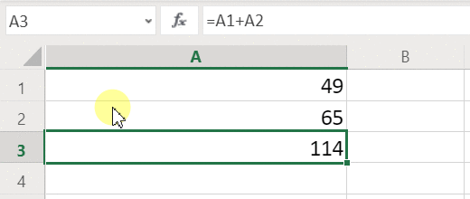

Excel doesn't have variables. The value of a cell that contains a formula changes based on its input, but there's no way to remember the result of a formula and store it in a cell or anywhere else. If you change a cell's value, the entire spreadsheet may change, and any previously calculated values are lost. An Excel user can copy and paste cells, but that's under the user's manual control and isn't possible with formulas.

### Power Fx

Logic that you create in Power Fx behaves very much like Excel. Instead of updating cells, you can add controls wherever you want on a screen and name them for use in formulas.

For example in Power Apps, you can replicate the Excel behavior in an app by adding a **[Label](controls/control-text-box.md)** control, named **Label1**, and two **[Text input](controls/control-text-input.md)** controls, named **TextInput1** and **TextInput2**. If you then set the **[Text](controls/properties-core.md)** property of **Label1** to **TextInput1 + TextInput2**, it will always show the sum of whatever numbers are in **TextInput1** and **TextInput2** automatically.

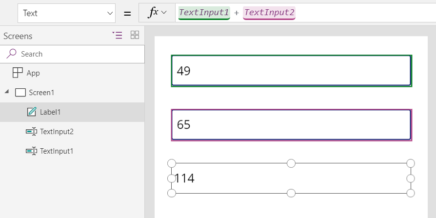

Notice that the **Label1** control is selected, showing its **[Text](controls/properties-core.md)** formula in the formula bar at the top of the screen. Here we find the formula **TextInput1 + TextInput2**. This formula creates a dependency between these controls, just as dependencies are created between cells in an Excel workbook.  Let's change the value of **TextInput1**:

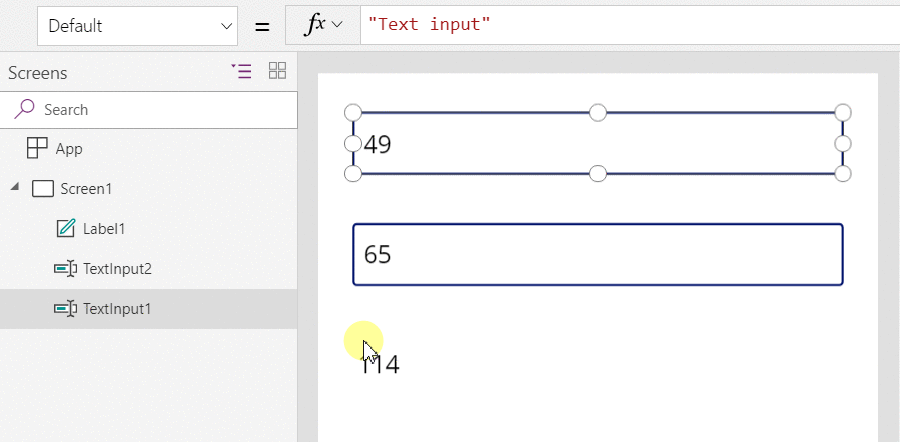

The formula for **Label1** has been automatically recalculated, showing the new value.

In Power Fx, you can use formulas to determine not only the primary value of a control but also properties such as formatting. In the next example, a formula for the **[Color](controls/properties-color-border.md)** property of the label will automatically show negative values in red. The **[If](functions/function-if.md)** function should look familiar from Excel:

`If( Value(Label1.Text) < 0, Red, Black )`

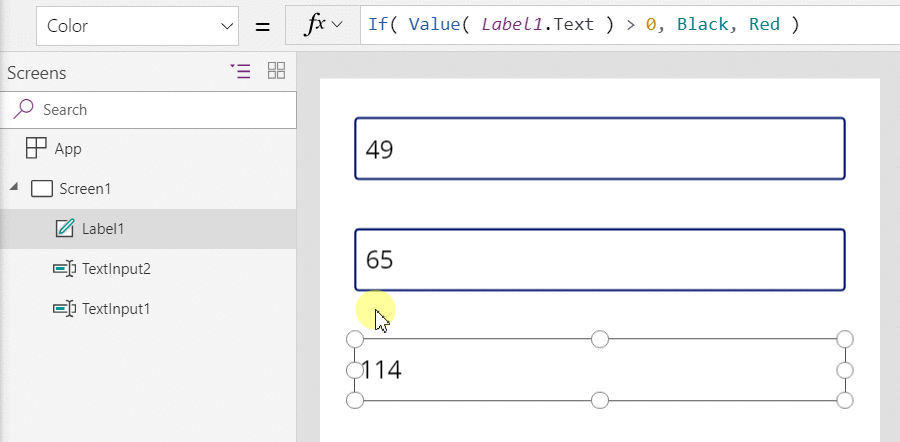

You can use formulas for a wide variety of scenarios:

* By using your device's GPS, a map control can display your current location with a formula that uses **Location.Latitude** and **Location.Longitude**.  As you move, the map will automatically track your location.
* Other users can update data sources.  For example, others on your team might update items in a SharePoint list.  When you refresh a data source, any dependent formulas are automatically recalculated to reflect the updated data. Furthering the example, you might set a gallery's **[Items](controls/properties-core.md)** property to the formula **Filter( SharePointList )**, which will automatically display the newly filtered set of [records](tables.md#records).

### Benefits

Using formulas to build apps has many advantages:

* If you know Excel, you know Power Fx. The model and formula language are the same.
* If you've used other programming tools, think about how much code would be required to accomplish these examples.  In Visual Basic, you'd need to write an event handler for the change event on each text-input control.  The code to perform the calculation in each of these is redundant and could get out of sync, or you'd need to write a common subroutine.  In Power Fx, you accomplished all of that with a single, one-line formula.
* To understand where **Label1**'s text is coming from, you know exactly where to look: the formula in the **[Text](controls/properties-core.md)** property.  There's no other way to affect the text of this control.  In a traditional programming tool, any event handler or subroutine could change the value of the label, from anywhere in the program.  This can make it hard to track down when and where a variable was changed.
* If the user changes a slider control and then changes their mind, they can change the slider back to its original value.  And it's as if nothing had ever changed: the app shows the same control values as it did before.  There are no ramifications for experimenting and asking "what if," just as there are none in Excel.  

In general, if you can achieve an effect by using a formula, you'll be better off. Let the formula engine in Power Fx do the work for you.  

## Know when to use variables

Let's change our simple adder to act like an old-fashioned adding machine, with a running total. If you select an **Add** button, you'll add a number to the running total. If you select a **Clear** button, you'll reset the running total to zero.

| Display | Description |
|----|----|
|  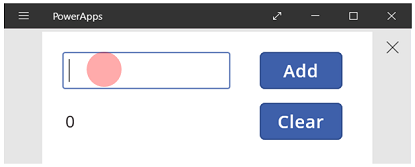 | When the app starts, the running total is 0.  The red dot represents the user's finger in the text-input box, where the user enters **77**. |
| 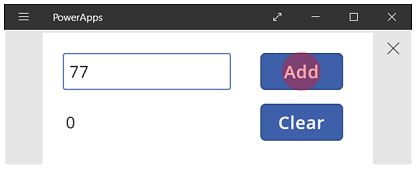 | The user selects the **Add** button. |
| 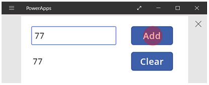 | 77 is added to the running total.  The user selects the **Add** button again. |
| 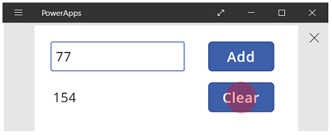 | 77 is again added to the running total, resulting in 154.  The user selects the **Clear** button. |
|  | The running total is reset to 0. |

Our adding machine uses something that doesn't exist in Excel: a button. In this app, you can't use only formulas to calculate the running total because its value depends on a series of actions that the user takes. Instead, our running total must be recorded and updated manually. Most programming tools store this information in a *variable*.

You'll sometimes need a variable for your app to behave the way you want.  But the approach comes with caveats:

* You must manually update the running total. Automatic recalculation won't do it for you.
* The running total can no longer be calculated based on the values of other controls. It depends on how many times the user selected the **Add** button and what value was in the text-input control each time. Did the user enter 77 and select **Add** twice, or did they specify 24 and 130 for each of the additions? You can't tell the difference after the total has reached 154.
* Changes to the total can come from different paths. In this example, both the **Add** and **Clear** buttons can update the total. If the app doesn't behave the way you expect, which button is causing the problem?

## Use a global variable

To create our adding machine, we require a variable to hold the running total. The simplest variables to work with in Power Fx are *global variables*.  

How global variables work:

* You set the value of the global variable with the **[Set](functions/function-set.md)** function.  **Set( MyVar, 1 )** sets the global variable **MyVar** to a value of **1**.
* You use the global variable by referencing the name used with the **Set** function.  In this case, **MyVar** will return **1**.
* Global variables can hold any value, including strings, numbers, records, and [tables](tables.md).

Let's rebuild our adding machine by using a global variable:

1. Add a text-input control, named **TextInput1**, and two buttons, named **Button1** and **Button2**.

2. Set the **Text** property of **Button1** to **"Add"**, and set the **Text** property of **Button2** to  **"Clear"**.

3. To update the running total whenever a user selects the **Add** button, set its **OnSelect** property to this formula:

    **Set( RunningTotal, RunningTotal + TextInput1 )**

    The mere existence of this formula establishes **RunningTotal** as a global variable that holds a number because of the **+** operator. You can reference **RunningTotal** anywhere in the app. Whenever the user opens this app, **RunningTotal** has an initial value of *blank*.

    The first time that a user selects the **Add** button and **[Set](functions/function-set.md)** runs, **RunningTotal** is set to the value **RunningTotal + TextInput1**.

    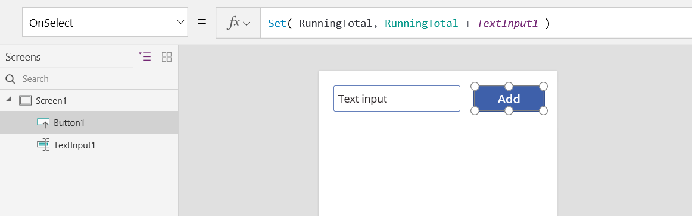

4. To set the running total to **0** whenever the user selects the **Clear** button, set its **OnSelect** property to this formula:

    **Set( RunningTotal, 0 )**

    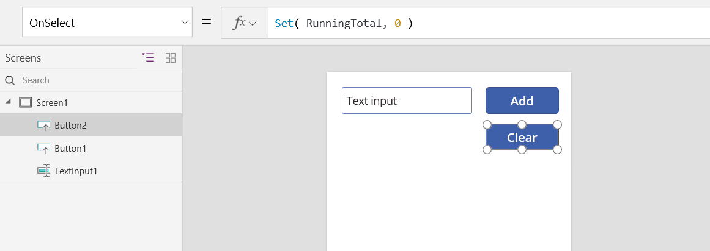

5. Add a **Label** control, and set its **Text** property to **RunningTotal**.

    This formula will automatically be recalculated and show the user the value of **RunningTotal** as it changes based on the buttons that the user selects.

    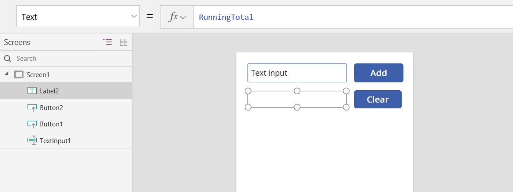

6. Preview the app, and we have our adding machine as described above. Enter a number in the text box and press the **Add** button a few times. When ready, return to the authoring experience using the Esc key.

    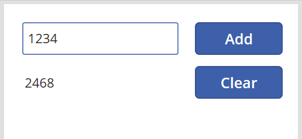

7. To show the global variable's value, select the **File** menu, and select **Variables** in the left-hand pane.

    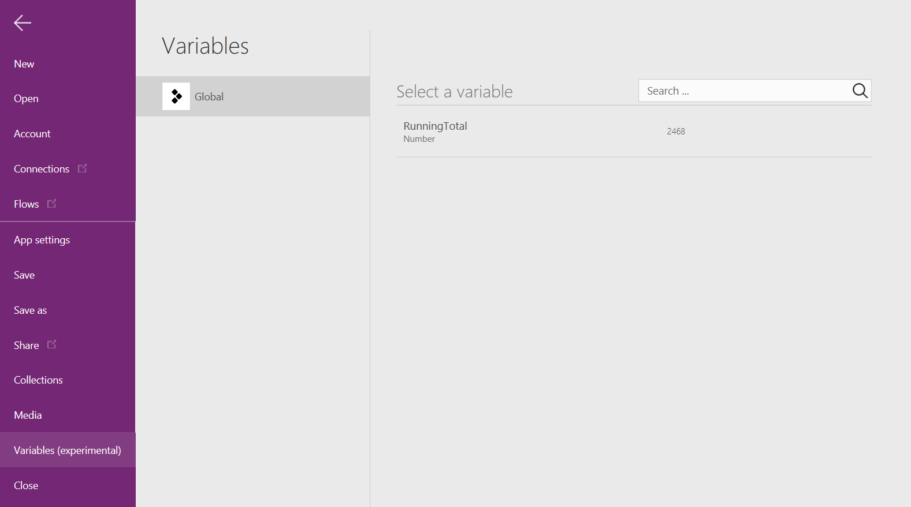

8. To show all the places where the variable is defined and used, select it.

    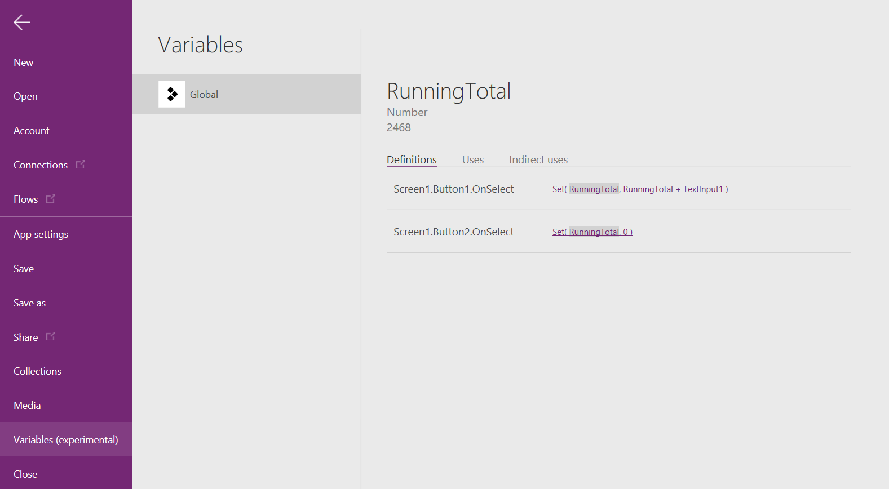

## Types of variables

Power Fx has two types of variables:

| Variables type | Scope | Description | Functions that establish |
| --- | --- | --- | --- |
| Global variables |App |Simplest to use. Holds a number, text string, Boolean, record, table, etc. that can be references from anywhere in the app. |[**Set**](functions/function-set.md) |
| Collections |App |Holds a table that can be referenced from anywhere in the app. Allows the contents of the table to be modified rather than being set as a whole. Can be saved to the local device for later use. |[**Collect**](functions/function-clear-collect-clearcollect.md) [**ClearCollect**](functions/function-clear-collect-clearcollect.md) |

When used in Power Apps, there is a third type of variable:

| Variables type | Scope | Description | Functions that establish |
| --- | --- | --- | --- |
| Context variables |Screen |Great for passing values to a screen, much like parameters to a procedure in other languages. Can be referenced from only one screen. |[**UpdateContext**](functions/function-updatecontext.md) [**Navigate**](functions/function-navigate.md) |

## Create and remove variables

All variables are created implicitly when they appear in a **Set**, **UpdateContext**, **Navigate**, **Collect**, or **ClearCollect** function. To declare a variable and its type, you need only include it in any of these functions anywhere in your app. None of these functions create variables; they only fill variables with values. You never declare variables explicitly as you might in another programming tool, and all typing is implicit from usage.

For example, you might have a button control with an **OnSelect** formula equal to **Set( X, 1 )**. This formula establishes **X** as a variable with a type of number. You can use **X** in formulas as a number, and that variable has a value of *blank* after you open the app but before you select the button. When you select the button, you give **X** the value of **1**.

If you added another button and set its **OnSelect** property to **Set( X, "Hello" )**, an error would occur because the type (text string) doesn't match the type in the previous **Set** (number). All implicit definitions of the variable must agree on type. Again, all this happened because you mentioned **X** in formulas, not because any of those formulas had actually run.

You remove a variable by removing all the **Set**, **UpdateContext**, **Navigate**, **Collect**, or **ClearCollect** functions that implicitly establish the variable. Without these functions, the variable doesn't exist. You must also remove any references to the variable because they will cause an error.

## Variable lifetime and initial value

All variables are held in memory while the app runs. After the app closes, the values that the variables held are lost.

You can store the contents of a variable in a data source by using the **Patch** or **Collect** functions. You can also store values in collections on the local device by using the [**SaveData**](functions/function-savedata-loaddata.md) function.

When the user opens the app, all variables have an initial value of *blank*.

## Reading variables

You use the variable's name to read its value. For example, you can define a variable with this formula:

`Set( Radius, 12 )`

Then you can simply use **Radius** anywhere that you can use a number, and it will be replaced with **12**:

`Pi() * Power( Radius, 2 )`

If you give a context variable the same name as a global variable or a collection, the context variable takes precedence. However, you can still reference the global variable or collection if you use the [disambiguation operator](functions/operators.md#disambiguation-operator) **[@Radius]**.

## Use a context variable (Power Apps only)

Let's look at how our adding machine would be created using a context variable instead of a global variable.

How context variables work:

* You implicitly establish and set context variables by using the **UpdateContext** or **Navigate** function. When the app starts, the initial value of all context variables is *blank*.
* You update context variables with records. In other programming tools, you commonly use "=" for assignment, as in "x = 1". For context variables, use **{ x: 1 }** instead. When you use a context variable, use its name directly without the record syntax.
* You can also set a context variable when you use the **Navigate** function to show a screen. If you think of a screen as a kind of procedure or subroutine, this approach resembles parameter passing in other programming tools.
* Except for **Navigate**, context variables are limited to the context of a single screen, which is where they get their name. You can't use or set them outside of this context.
* Context variables can hold any value, including strings, numbers, records, and [tables](tables.md).

Let's rebuild our adding machine by using a context variable:

1. Add a text-input control, named **TextInput1**, and two buttons, named **Button1** and **Button2**.

2. Set the **Text** property of **Button1** to **"Add"**, and set the **Text** property of **Button2** to  **"Clear"**.

3. To update the running total whenever a user selects the **Add** button, set its **OnSelect** property to this formula:

    **UpdateContext( { RunningTotal: RunningTotal + TextInput1 } )**

    The mere existence of this formula establishes **RunningTotal** as a context variable that holds a number because of the **+** operator. You can reference **RunningTotal** anywhere in this screen. Whenever the user opens this app, **RunningTotal** has an initial value of *blank*.

    The first time that the user selects the **Add** button and **[UpdateContext](functions/function-updatecontext.md)** runs, **RunningTotal** is set to the value **RunningTotal + TextInput1**.

    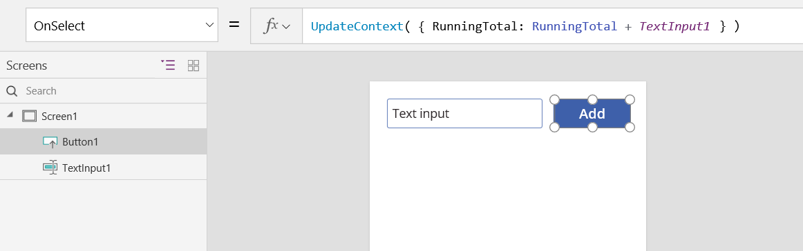

4. To set the running total to **0** whenever the user selects the **Clear** button, set its **OnSelect** property to this formula:

    **UpdateContext( { RunningTotal: 0 } )**

    Again, **[UpdateContext](functions/function-updatecontext.md)** is used with the formula **UpdateContext( { RunningTotal: 0 } )**.

    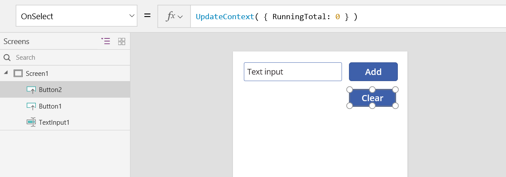

5. Add a **Label** control, and set its **Text** property to **RunningTotal**.

    This formula will automatically be recalculated and show the user the value of **RunningTotal** as it changes based on the buttons that the user selects.

    

6. Preview the app and we have our adding machine as described above. Enter a number in the text box and press the **Add** button a few times. When ready, return to the authoring experience using the Esc key.

    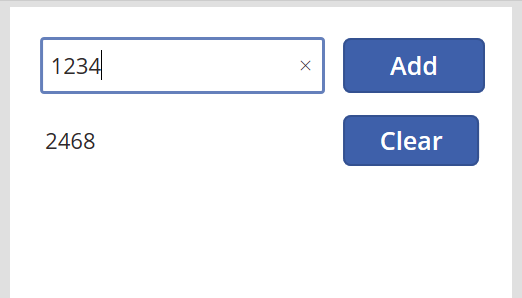

7. You can set the value of a context variable while navigating to a screen. This is useful for passing "context" or "parameters" from one screen to another. To demonstrate this technique, insert a screen, insert a button, and set its **OnSelect** property to this formula:

    **Navigate( Screen1, None, { RunningTotal: -1000 } )**

    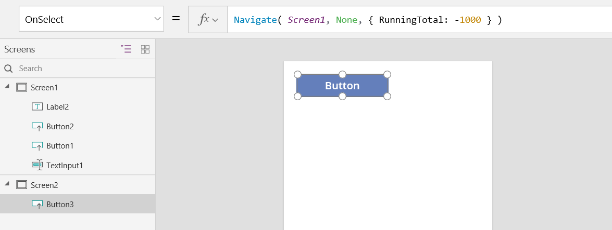

    Hold down the Alt key while you select this button to both show **Screen1** and set the context variable **RunningTotal** to -1000.

    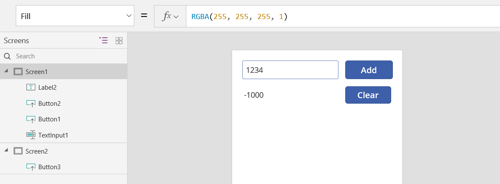

8. To show the value of the context variable, select the **File** menu, and then select **Variables** in the left-hand pane.

    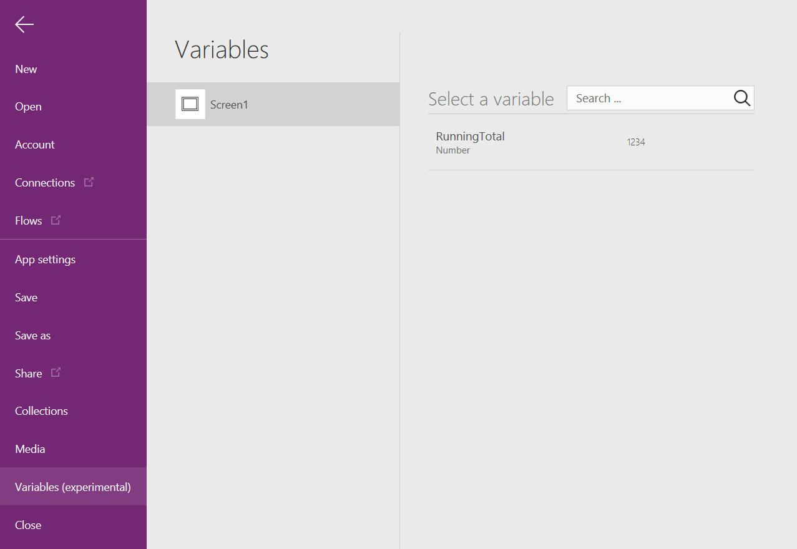

9. To show where the context variable is defined and used, select it.

    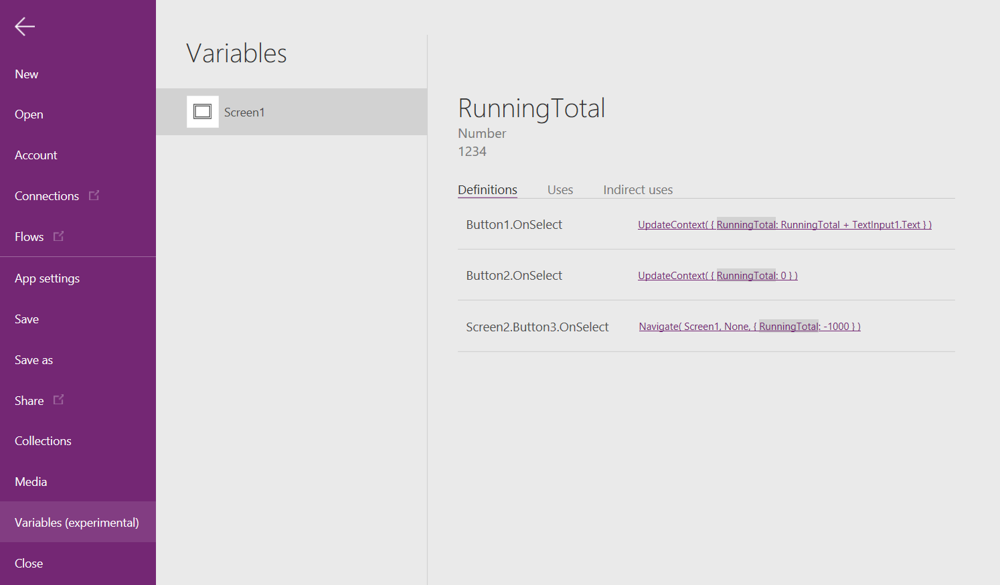

## Use a collection

Finally, let's look at creating our adding machine with a collection.  Since a collection holds a table that is easy to modify, we will make this adding machine keep a "paper tape" of each value as they are entered.

How collections work:

* Create and set collections by using the **ClearCollect** function.  You can use the **Collect** function instead, but it will effectively require another variable instead of replacing the old one.  
* A collection is a kind of data source and, therefore, a table. To access a single value in a collection, use the **First** function, and extract one field from the resulting record. If you used a single value with **ClearCollect**, this will be the **Value** field, as in this example: 
**First(** *VariableName* **).Value**

Let's recreate our adding machine by using a collection:

1. Add a **Text input** control, named **TextInput1**, and two buttons, named **Button1** and **Button2**.

2. Set the **Text** property of **Button1** to **"Add"**, and set the **Text** property of **Button2** to **"Clear"**.

3. To update the running total whenever a user selects the **Add** button, set its **OnSelect** property to this formula:

    **Collect( PaperTape, TextInput1.Text )**

    The mere existence of this formula establishes **PaperTape** as a collection that holds a single-column table of text strings. You can reference **PaperTape** anywhere in this app. Whenever a user opens this app, **PaperTape** is an empty table.

    When this formula runs, it adds the new value to the end of the collection. Because we're adding a single value, **Collect** automatically places it in a single-column table, and the column's name is **Value**, which you'll use later.

    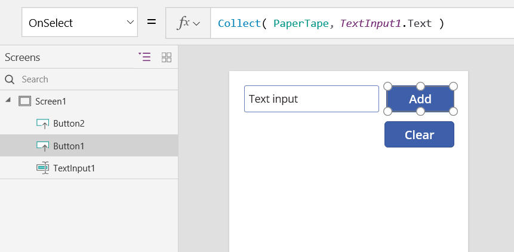

4. To clear the paper tape when the user selects the **Clear** button, set its **[OnSelect](controls/properties-core.md)** property to this formula:

    **Clear( PaperTape )**

    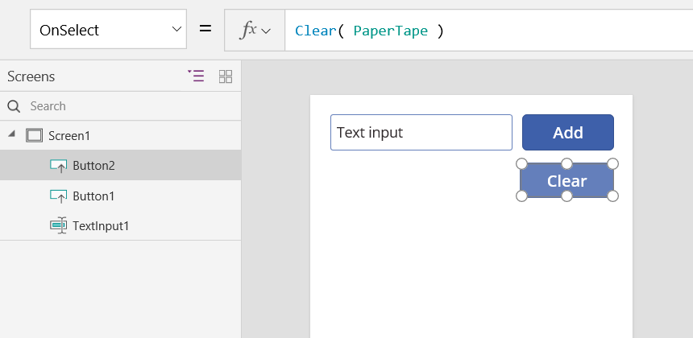

5. To display the running total, add a label, and set its **[Text](controls/properties-core.md)** property to this formula:

    **Sum( PaperTape, Value )**

    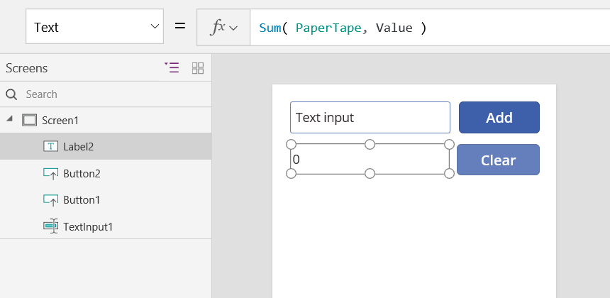

6. To run the adding machine, press F5 to open Preview, enter numbers in the text-input control, and select buttons.

    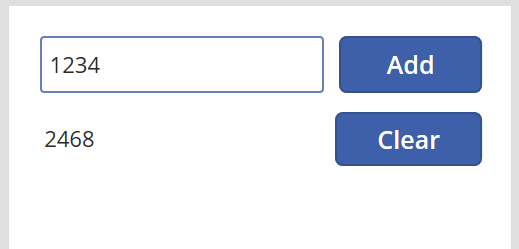

7. To return to the default workspace, press the Esc key.

8. To display the paper tape, insert a **Data table** control, and set its **[Items](controls/properties-core.md)** property to this formula:

    **PaperTape**

    In the right-hand pane, select **Edit fields** and then select **Add field**, select **Value** column and then select **Add** to show it.

    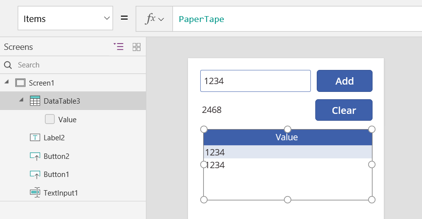

9. To see the values in your collection, select **Collections** on the **File** menu.

    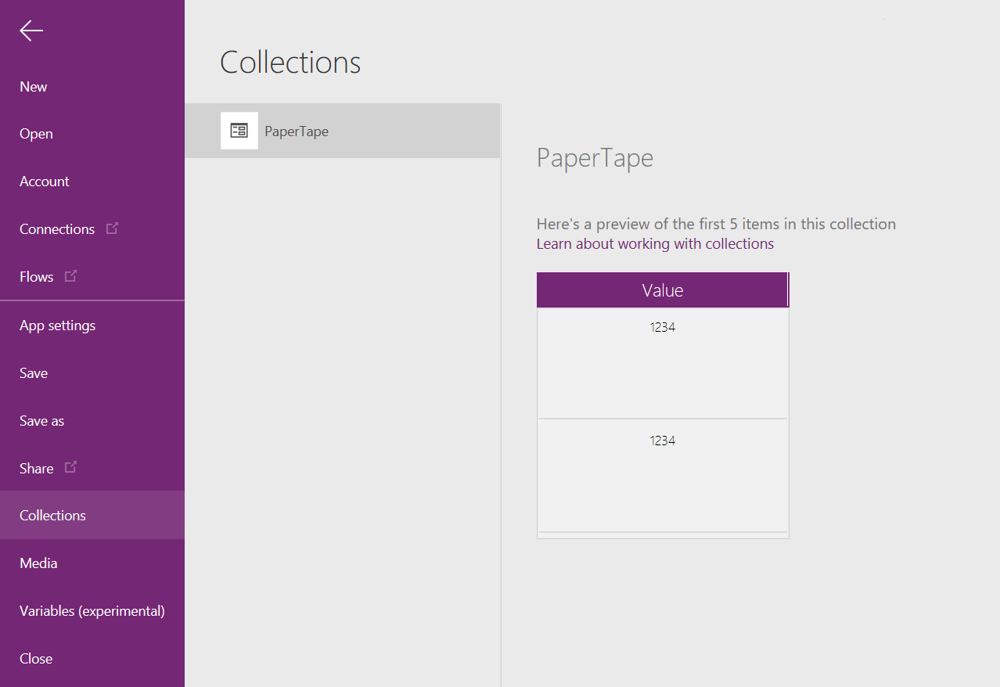

10. To store and retrieve your collection, add two additional button controls, and set their **Text** properties to **Load** and **Save**. Set the **OnSelect** property of the **Load** button to this formula:

     **Clear( PaperTape ); LoadData( PaperTape, "StoredPaperTape", true )**

     You need to clear the collection first because **LoadData** will append the stored values to the end of the collection.

     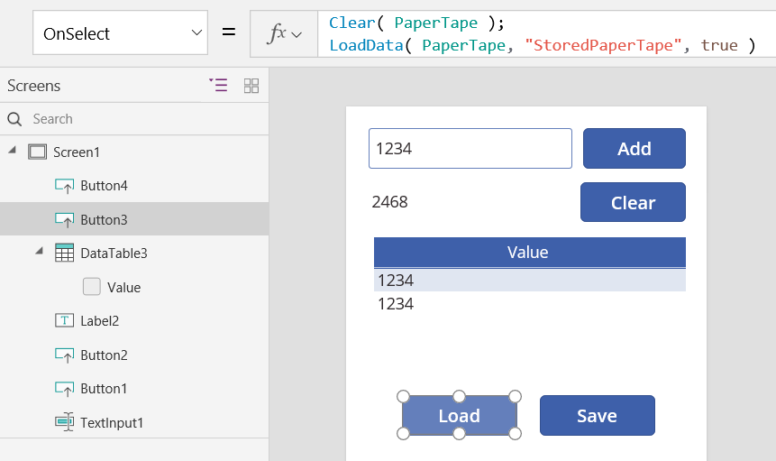

11. Set the **OnSelect** property of the **Save** button to this formula:

     **SaveData( PaperTape, "StoredPaperTape" )**

     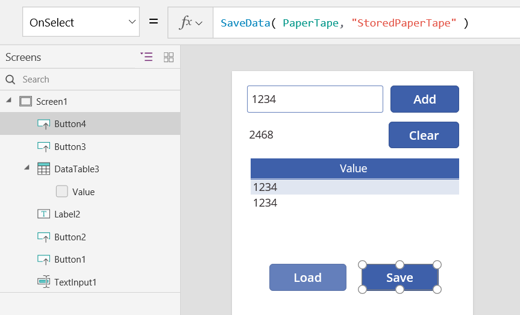

12. Preview again by pressing the F5 key, enter numbers in the text-input control, and select buttons. Select the **Save** button. Close and reload the app, and select the **Load** button to reload your collection.

